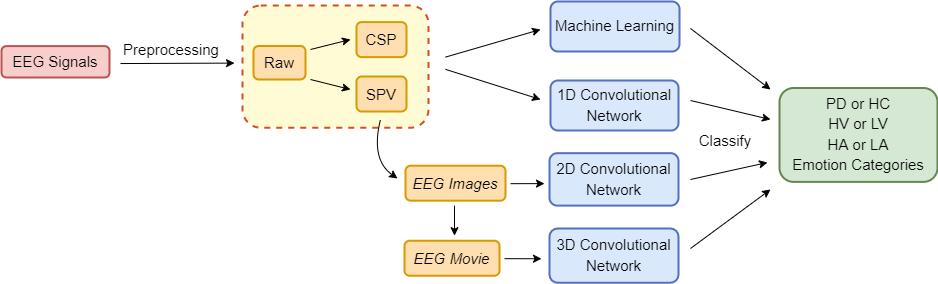

# Examining Emotion Perception in Parkinson's Disease Patients using EEG Signals

This is the official GitHub repository for the paper "Examining Emotion Perception in Parkinson's Disease Patients using EEG Signals".

While Parkinson’s disease (PD) is typically characterized by motor disorder, there is evidence of diminished emotion perception in PD patients. This study examines the utility of affective Electroencephalography (EEG) signals to understand emotional differences between PD vs Healthy Controls (HC), and for automated PD detection. Employing traditional machine learning and deep learning methods, we explore (a) dimensional and categorical emotion recognition, and (b) PD vs HC classification from emotional EEG signals. Our results reveal that PD patients comprehend arousal better than valence, and amongst emotion categories, fear, disgust and surprise less accurately, and sadness most accurately. Mislabeling analyses confirm confounds among opposite-valence emotions with PD data. Emotional EEG responses also achieve near-perfect PD vs HC recognition. Cumulatively, our study demonstrates that (a) examining implicit responses alone enables (i) discovery of valence-related impairments in PD patients, and (ii) differentiation of PD from HC, and (b) emotional EEG analysis is an ecologically-valid, effective, facile and sustainable tool for PD diagnosis vis-a ́-vis self reports, expert assessments and resting-state analysis.

## Overview

Our pipeline involves (a) EEG pre-processing and extraction of features such as Spectral Power Vectors (SPV) and Common Spatial Patterns (CSP), (b) feeding of these features or derived representations such as EEG images and movies to machine and deep learning frameworks to perform (i) dimensional and discrete emotion recognition, and (ii) PD vs HC classification.

